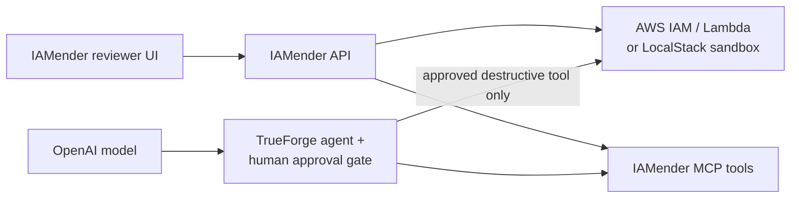

# IAMender

> **Amend AWS IAM safely.** IAMender finds excessive access, proposes the smallest evidence-backed policy, explains the blast radius, and makes a reversible change only after a human approves it.

Built for **Agents That Act — TrueFoundry × Polaris**.

## Why this matters

IAM cleanup is easy to postpone and dangerous to rush. Teams accumulate `AdministratorAccess`, service wildcards such as `s3:*` on `*`, and dormant roles because nobody can confidently answer one question: **what will break if we remove this permission?**

IAMender closes that loop:

1. **Find** risky identities and rank them by security risk, spend authority, and evidence confidence.
2. **Investigate** the policy and attached workload to identify the minimum access actually supported by evidence.
3. **Explain** what keeps working, what changes, and what could break in a plain-language blast-radius brief.
4. **Pause** at a native TrueForge human approval gate before an IAM write.
5. **Apply** a new customer-managed policy version and keep the prior version ready for rollback.
6. **Verify** the workload after the amendment.

## Demo at a glance

The bundled LocalStack sandbox starts deliberately unsafe:

| Identity | What IAMender finds | Decision |
| --- | --- | --- |
| `ci-deploy-role` | `*` on `*` / administrator-like access | Needs more deployment evidence — **no guesswork** |
| `lambda-report-role` | `s3:*` on `*` | Proposes bucket-scoped read access and enters approval |
| `legacy-export-role` | Dormant role with retained access | Requires a human retirement review |

For the Lambda, IAMender reduces broad S3 authority to:

```json
{
  "Version": "2012-10-17",
  "Statement": [
    {
      "Effect": "Allow",
      "Action": "s3:ListBucket",
      "Resource": "arn:aws:s3:::iamender-reports"
    },
    {
      "Effect": "Allow",
      "Action": "s3:GetObject",
      "Resource": "arn:aws:s3:::iamender-reports/*"
    }
  ]
}
```

The demo then invokes the Lambda to prove the report path continues to work. The old policy version remains available for a separately approved rollback.

## Architecture



- **IAMender UI** is where a reviewer sees findings, policy deltas, blast radius, service readiness, and the post-approval state.
- **IAMender API + MCP tools** collect IAM/workload evidence, validate and simulate proposals, invoke the verification Lambda, and expose the narrowly scoped apply/rollback tools.
- **TrueForge** runs the agent in its sandbox and blocks destructive tools until a human clicks **Allow**.
- **AWS / LocalStack** is the system being amended. The local sandbox lets the complete workflow run safely and reproducibly.
- **OpenAI** turns structured evidence into a readable recommendation and blast-radius brief; it never has an unrestricted IAM write path.

## Safety model

IAMender is deliberately opinionated about what it will not do.

- Read, analyse, validate, and simulate operations are safe to run freely.
- `apply_policy_version` and `rollback_policy_version` are marked destructive in the MCP server and require native TrueForge approval.
- Writes are disabled by default with `IAMENDER_ALLOW_WRITE=false`.
- An approved write is limited to the exact `IAMENDER_TARGET_POLICY_ARN`; v1 cannot modify another identity or policy.
- A change creates a new policy version instead of overwriting history. Rollback uses the same approval boundary.
- If evidence is incomplete, IAMender reports **Needs evidence** rather than fabricating a least-privilege policy.

> LocalStack is a safe demo environment. Its policy simulation is structural and does not replace AWS IAM Policy Simulator, CloudTrail, Access Analyzer, or service-last-accessed evidence in a production account.

## Run the full local demo

### Prerequisites

- Node.js 20+
- Docker Desktop
- An OpenAI API key configured in the local TrueForge UI

### 1. Install and configure

```bash
npm install
cp .env.example .env
```

For the LocalStack demo, set these values in `.env`:

```dotenv
IAMENDER_LOCAL_MODE=true
IAMENDER_AWS_ENDPOINT_URL=http://localhost:4566
IAMENDER_TARGET_POLICY_ARN=arn:aws:iam::000000000000:policy/IamenderLambdaReportBroadS3
IAMENDER_TRUEFORGE_MODEL=openai/gpt-5-6-terra
```

Keep `IAMENDER_ALLOW_WRITE=false`. It is only toggled for the short, explicitly approved sandbox apply run.

### 2. Start and seed the AWS-like sandbox

```bash
npm run localstack:up
npm run seed:local
```

### 3. Start TrueForge

In a separate terminal:

```bash
OUTBOUND_URL_ALLOWED_HOSTS='["127.0.0.1"]' npx @truefoundry/trueforge
```

Open `http://localhost:8790`, add an OpenAI provider/key in **Settings → Models**, and ensure the configured model matches `IAMENDER_TRUEFORGE_MODEL`.

### 4. Start IAMender

Use two terminals:

```bash
npm run agent:server
```

```bash
npm run dev
```

Open `http://localhost:5173`. The UI’s **Check services** control confirms LocalStack, IAMender tools, and TrueForge are ready.

### 5. Run the approval flow

1. Select `lambda-report-role` in IAMender.
2. Review the evidence, policy delta, blast radius, and rollback plan.
3. Choose **Review approval run** to open the TrueForge trace.
4. Ask the agent to apply *only* the shown scoped policy.
5. At the native `apply_policy_version` tool checkpoint, inspect the policy ARN/document and click **Allow**.
6. Return to IAMender and choose **Refresh live data**. The finding changes to **Least-privilege policy is active**.

For the deliberately destructive LocalStack demo step only, enable `IAMENDER_ALLOW_WRITE=true`, restart `npm run agent:server`, complete the TrueForge approval, then restore it to `false` and restart the server again. Never enable this switch for an unreviewed policy or an unrestricted production account.

## Useful commands

```bash
# Inspect findings and recommendation state
npm run agent -- analyze

# Invoke the sandbox Lambda verification route
npm run agent -- verify-lambda --function-name iamender-report-lambda

# Type-check and create a production frontend build
npm run agent:check
npm run build
```

## Production extension

The demo scope is intentionally one account and seeded identities. The next step is to enrich evidence before widening autonomous scope:

- CloudTrail usage history and IAM service-last-accessed data
- IAM Access Analyzer validation and AWS IAM Policy Simulator results
- resource tags, owners, permission boundaries, and change windows
- multi-account AWS Organizations support
- a durable approval/audit store and signed rollback records

Until that evidence exists, IAMender should remain conservative: identify risk, explain uncertainty, and ask for a human decision.
